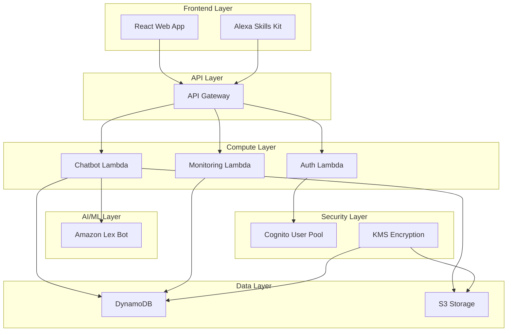

# 🎤 Voice Assistant AI - Complete AWS Setup Guide

A production-ready, serverless voice assistant application built on AWS with Alexa integration, featuring real-time voice processing, natural language understanding, and a modern web interface.


## 🎯 What You'll Build

By following this guide, you'll deploy a complete voice assistant system with:

- **🎙️ Voice Interface**: Real-time speech recognition and synthesis
- **🤖 AI Chatbot**: Natural language understanding with Amazon Lex
- **🔊 Alexa Integration**: Native Alexa Skills Kit support
- **🌐 Web Dashboard**: Modern React-based interface
- **🔐 User Authentication**: Secure login with Amazon Cognito
- **📊 Monitoring**: Real-time dashboards and alerts
- **🚀 Auto-scaling**: Serverless architecture that scales automatically

## 🏗️ System Architecture



## � Prerequisites & Requirements

### 🛠️ Required Tools

| Tool | Version | Purpose | Download Link |
|------|---------|---------|---------------|
| **AWS CLI** | v2.0+ | AWS service management | [Download](https://aws.amazon.com/cli/) |
| **Terraform** | v1.0+ | Infrastructure as Code | [Download](https://www.terraform.io/downloads) |
| **Node.js** | v18+ | Frontend development | [Download](https://nodejs.org/) |
| **Python** | v3.9+ | Backend development | [Download](https://www.python.org/) |
| **Git** | Latest | Version control | [Download](https://git-scm.com/) |

### 🏦 AWS Account Setup

#### Step 1: Create AWS Account
1. Go to [AWS Console](https://aws.amazon.com/console/)
2. Click "Create a new AWS account"
3. Follow the registration process
4. **Important**: Enable billing alerts in your account

#### Step 2: Create IAM User for Deployment
```bash
# Create IAM user with programmatic access
aws iam create-user --user-name voice-assistant-deployer

# Attach necessary policies
aws iam attach-user-policy --user-name voice-assistant-deployer --policy-arn arn:aws:iam::aws:policy/PowerUserAccess
aws iam attach-user-policy --user-name voice-assistant-deployer --policy-arn arn:aws:iam::aws:policy/IAMFullAccess

# Create access keys
aws iam create-access-key --user-name voice-assistant-deployer
```

#### Step 3: Configure AWS CLI
```bash
aws configure
# AWS Access Key ID: [Enter your access key]
# AWS Secret Access Key: [Enter your secret key]
# Default region name: us-east-1
# Default output format: json
```

### 💰 Cost Estimation

| Service | Monthly Cost (Estimate) | Usage Assumption |
|---------|------------------------|------------------|
| **Lambda** | $5-20 | 100K requests/month |
| **DynamoDB** | $2-10 | 1GB storage, 100K reads/writes |
| **API Gateway** | $3-15 | 100K API calls |
| **S3** | $1-5 | 10GB storage |
| **Cognito** | $0-5 | <50K MAU (free tier) |
| **Lex** | $4-20 | 10K text requests |
| **CloudWatch** | $2-8 | Standard monitoring |
| **Total** | **$17-83/month** | Small to medium usage |

## � Complete Setup Guide

**Choose Your Deployment Method:**
- **🔧 [Option A: With Terraform (Recommended)](#option-a-terraform-deployment)** - Automated infrastructure deployment
- **🖱️ [Option B: Manual AWS Console Setup](#option-b-manual-aws-console-setup)** - Step-by-step manual configuration

---

## 🔧 Option A: Terraform Deployment

### Phase 1: Project Setup and Configuration

#### Step 1: Clone and Initialize Project
```bash
# Clone the repository
git clone https://github.com/your-org/voice-assistant-ai.git
cd voice-assistant-ai

# Make scripts executable
chmod +x scripts/*.sh
chmod +x pipeline/scripts/*.py

# Install Python dependencies for deployment
pip install boto3 terraform-compliance bandit safety
```

#### Step 2: Environment Configuration
```bash
# Copy environment template
cp infra/terraform/terraform.tfvars.example infra/terraform/terraform.tfvars

# Edit the configuration file
nano infra/terraform/terraform.tfvars
```

**Configure your `terraform.tfvars`:**
```hcl
# Basic Configuration
aws_region = "us-east-1"
project_name = "voice-assistant-ai"
environment = "prod"

# Contact Information
alert_email_addresses = ["your-email@company.com"]

# Feature Flags
enable_alexa_integration = true
enable_web_interface = true
enable_voice_recording = true
enable_analytics = true

# Resource Configuration
lambda_timeout = 30
lambda_memory_size = 512
lambda_reserved_concurrency = 10
dynamodb_billing_mode = "PAY_PER_REQUEST"
log_retention_days = 14
```

### Phase 2: AWS Infrastructure Deployment

#### Step 3: Deploy Core Infrastructure
```bash
# Initialize Terraform
cd infra/terraform
terraform init

# Validate configuration
terraform validate

# Plan deployment (review what will be created)
terraform plan -var-file="terraform.tfvars"

# Deploy infrastructure (this takes 10-15 minutes)
terraform apply -var-file="terraform.tfvars"
```

**What gets created:**
- ✅ API Gateway with REST endpoints
- ✅ Lambda functions (chatbot, auth, monitoring)
- ✅ DynamoDB tables for conversations and sessions
- ✅ S3 buckets for file storage
- ✅ Cognito User Pool for authentication
- ✅ CloudWatch dashboards and alarms
- ✅ KMS keys for encryption
- ✅ IAM roles and policies

#### Step 4: Verify Infrastructure Deployment
```bash
# Check created resources
terraform output

# Verify Lambda functions
aws lambda list-functions --query 'Functions[?starts_with(FunctionName, `voice-assistant-ai`)].[FunctionName,Runtime,LastModified]' --output table

# Verify DynamoDB tables
aws dynamodb list-tables --query 'TableNames[?starts_with(@, `voice-assistant-ai`)]' --output table

# Verify S3 buckets
aws s3 ls | grep voice-assistant-ai
```

### Phase 3: Amazon Lex Bot Configuration

#### Step 5: Create and Configure Lex Bot

**Option A: Using AWS Console (Recommended for beginners)**

1. **Go to Amazon Lex Console**
   - Navigate to [Amazon Lex Console](https://console.aws.amazon.com/lexv2/)
   - Click "Create bot"

2. **Bot Configuration**
   ```
   Bot name: voice-assistant-ai-prod-bot
   Description: Voice Assistant AI Bot for Production
   IAM role: Create a new role
   Language: English (US)
   Voice interaction: Joanna (Neural)
   Session timeout: 5 minutes
   ```

3. **Create Intents**

   **Welcome Intent:**
   ```
   Intent name: WelcomeIntent
   Sample utterances:
   - Hello
   - Hi there
   - Good morning
   - Hey
   - Start

   Response:
   - "Hello! I'm your voice assistant. How can I help you today?"
   ```

   **Help Intent:**
   ```
   Intent name: HelpIntent
   Sample utterances:
   - Help
   - What can you do
   - How do I use this
   - Commands

   Response:
   - "I can help you with various tasks. Try asking me about the weather, news, or setting reminders!"
   ```

4. **Build and Test Bot**
   - Click "Build" (takes 2-3 minutes)
   - Test in the console with sample phrases
   - Create an alias named "prod"

**Option B: Using Automated Script**
```bash
# Deploy Lex bot using automation script
cd pipeline/scripts
python deploy_lex.py \
  --bot-config ../../lex/bot-config.json \
  --locale-config ../../lex/locale-config.json \
  --intents-config ../../lex/intents.json \
  --environment prod \
  --lambda-arn $(aws lambda get-function --function-name voice-assistant-ai-chatbot-prod --query 'Configuration.FunctionArn' --output text)
```

### Phase 4: Lambda Function Deployment

#### Step 6: Package and Deploy Lambda Functions
```bash
# Return to project root
cd ../../

# Package and deploy chatbot function
python pipeline/scripts/package_lambda.py \
  --function-dir backend/lambda_functions/chatbot_handler \
  --function-name chatbot \
  --environment prod \
  --publish-version \
  --update-alias prod

# Package and deploy auth function
python pipeline/scripts/package_lambda.py \
  --function-dir backend/lambda_functions/auth_handler \
  --function-name auth \
  --environment prod \
  --publish-version \
  --update-alias prod

# Package and deploy monitoring function
python pipeline/scripts/package_lambda.py \
  --function-dir backend/lambda_functions/monitoring_handler \
  --function-name monitoring \
  --environment prod \
  --publish-version \
  --update-alias prod
```

#### Step 7: Configure Lambda Environment Variables
```bash
# Get infrastructure outputs
API_GATEWAY_URL=$(cd infra/terraform && terraform output -raw api_gateway_url)
DYNAMODB_TABLE=$(cd infra/terraform && terraform output -raw dynamodb_table_name)
S3_BUCKET=$(cd infra/terraform && terraform output -raw s3_bucket_name)
LEX_BOT_ID=$(aws lexv2-models list-bots --query 'botSummaries[?botName==`voice-assistant-ai-prod-bot`].botId' --output text)

# Update chatbot Lambda environment
aws lambda update-function-configuration \
  --function-name voice-assistant-ai-chatbot-prod \
  --environment Variables="{
    \"DYNAMODB_TABLE_NAME\":\"$DYNAMODB_TABLE\",
    \"S3_BUCKET_NAME\":\"$S3_BUCKET\",
    \"LEX_BOT_ID\":\"$LEX_BOT_ID\",
    \"ENVIRONMENT\":\"prod\"
  }"

# Update auth Lambda environment
aws lambda update-function-configuration \
  --function-name voice-assistant-ai-auth-prod \
  --environment Variables="{
    \"DYNAMODB_TABLE_NAME\":\"$DYNAMODB_TABLE\",
    \"ENVIRONMENT\":\"prod\"
  }"

# Update monitoring Lambda environment
aws lambda update-function-configuration \
  --function-name voice-assistant-ai-monitoring-prod \
  --environment Variables="{
    \"DYNAMODB_TABLE_NAME\":\"$DYNAMODB_TABLE\",
    \"ENVIRONMENT\":\"prod\"
  }"
```

### Phase 5: Frontend Deployment

#### Step 8: Configure and Deploy React Frontend

**Option A: Deploy to AWS Amplify (Recommended)**

1. **Setup Amplify CLI**
```bash
# Install Amplify CLI
npm install -g @aws-amplify/cli

# Configure Amplify
amplify configure
```

2. **Initialize Amplify Project**
```bash
cd frontend

# Initialize Amplify
amplify init
# Project name: voice-assistant-ai-frontend
# Environment: prod
# Default editor: Visual Studio Code
# App type: javascript
# Framework: react
# Source directory: src
# Build directory: build
# Build command: npm run build
# Start command: npm start
```

3. **Configure Environment Variables**
```bash
# Get infrastructure outputs
cd ../infra/terraform
API_GATEWAY_URL=$(terraform output -raw api_gateway_url)
COGNITO_USER_POOL_ID=$(terraform output -raw cognito_user_pool_id)
COGNITO_CLIENT_ID=$(terraform output -raw cognito_user_pool_client_id)
COGNITO_IDENTITY_POOL_ID=$(terraform output -raw cognito_identity_pool_id)
S3_BUCKET=$(terraform output -raw s3_bucket_name)

# Create environment file
cd ../../frontend
cat > .env.production << EOF
REACT_APP_API_GATEWAY_URL=$API_GATEWAY_URL
REACT_APP_COGNITO_USER_POOL_ID=$COGNITO_USER_POOL_ID
REACT_APP_COGNITO_CLIENT_ID=$COGNITO_CLIENT_ID
REACT_APP_COGNITO_IDENTITY_POOL_ID=$COGNITO_IDENTITY_POOL_ID
REACT_APP_S3_BUCKET=$S3_BUCKET
REACT_APP_AWS_REGION=us-east-1
REACT_APP_ENVIRONMENT=prod
EOF
```

4. **Build and Deploy**
```bash
# Install dependencies
npm install

# Build the application
npm run build

# Deploy to Amplify
amplify publish
```

**Option B: Deploy to S3 + CloudFront**
```bash
# Build the application
npm run build

# Deploy to S3
aws s3 sync build/ s3://$(cd ../infra/terraform && terraform output -raw s3_bucket_name) --delete

# Invalidate CloudFront cache (if using CloudFront)
aws cloudfront create-invalidation --distribution-id YOUR_DISTRIBUTION_ID --paths "/*"
```

### Phase 6: Amazon Cognito User Management

#### Step 9: Configure Cognito and Create Test Users

1. **Create Admin User**
```bash
# Get Cognito User Pool ID
USER_POOL_ID=$(cd infra/terraform && terraform output -raw cognito_user_pool_id)

# Create admin user
aws cognito-idp admin-create-user \
  --user-pool-id $USER_POOL_ID \
  --username admin@yourcompany.com \
  --user-attributes Name=email,Value=admin@yourcompany.com \
  --temporary-password TempPassword123! \
  --message-action SUPPRESS

# Set permanent password
aws cognito-idp admin-set-user-password \
  --user-pool-id $USER_POOL_ID \
  --username admin@yourcompany.com \
  --password YourSecurePassword123! \
  --permanent
```

2. **Configure Cognito Settings in AWS Console**
   - Go to [Cognito Console](https://console.aws.amazon.com/cognito/)
   - Select your User Pool
   - Configure:
     - Password policy
     - MFA settings (optional)
     - Email verification
     - Custom attributes

### Phase 7: Monitoring and Alerting Setup

#### Step 10: Configure CloudWatch Dashboards and Alarms

1. **Create CloudWatch Dashboard**
```bash
# Deploy monitoring dashboard
aws cloudwatch put-dashboard \
  --dashboard-name voice-assistant-ai-prod \
  --dashboard-body file://monitoring/dashboards/main-dashboard.json
```

2. **Setup SNS Notifications**
```bash
# Get SNS topic ARN
SNS_TOPIC_ARN=$(cd infra/terraform && terraform output -raw sns_alerts_topic_arn)

# Subscribe to alerts
aws sns subscribe \
  --topic-arn $SNS_TOPIC_ARN \
  --protocol email \
  --notification-endpoint your-email@company.com

# Confirm subscription in your email
```

3. **Deploy CloudWatch Alarms**
```bash
# Deploy Lambda monitoring alarms
cd monitoring/alarms
terraform init
terraform apply -var="sns_topic_arn=$SNS_TOPIC_ARN"
```

### Phase 8: Security Configuration

#### Step 11: Configure Secrets and Security

1. **Store Application Secrets**
```bash
# Create secrets for JWT and encryption
aws secretsmanager create-secret \
  --name voice-assistant-ai/api-keys \
  --description "API keys and secrets for Voice Assistant AI" \
  --secret-string '{
    "jwt_secret":"'$(openssl rand -base64 32)'",
    "encryption_key":"'$(openssl rand -hex 32)'"
  }'

# Create database secrets (if using RDS)
aws secretsmanager create-secret \
  --name voice-assistant-ai/database \
  --description "Database credentials" \
  --secret-string '{
    "username":"admin",
    "password":"'$(openssl rand -base64 16)'"
  }'
```

2. **Configure KMS Key Permissions**
```bash
# Get KMS key ID
KMS_KEY_ID=$(cd infra/terraform && terraform output -raw kms_key_id)

# Update key policy (if needed)
aws kms describe-key --key-id $KMS_KEY_ID
```

### Phase 9: Testing and Validation

#### Step 12: Comprehensive System Testing

1. **API Health Checks**
```bash
# Test API Gateway health endpoint
API_URL=$(cd infra/terraform && terraform output -raw api_gateway_url)
curl -X GET "$API_URL/health"

# Expected response: {"status": "healthy", "timestamp": "..."}
```

2. **Lambda Function Testing**
```bash
# Test chatbot Lambda
aws lambda invoke \
  --function-name voice-assistant-ai-chatbot-prod \
  --payload '{"httpMethod":"POST","body":"{\"message\":\"Hello\",\"type\":\"text\"}"}' \
  response.json

cat response.json

# Test auth Lambda
aws lambda invoke \
  --function-name voice-assistant-ai-auth-prod \
  --payload '{"httpMethod":"GET","path":"/health"}' \
  auth-response.json

cat auth-response.json
```

3. **Frontend Testing**
```bash
# Test frontend deployment
curl -I https://your-amplify-domain.amplifyapp.com
# Should return 200 OK

# Test with browser
echo "Open your browser and navigate to: https://your-amplify-domain.amplifyapp.com"
```

4. **Lex Bot Testing**
```bash
# Test Lex bot directly
aws lexv2-runtime recognize-text \
  --bot-id $LEX_BOT_ID \
  --bot-alias-id TSTALIASID \
  --locale-id en_US \
  --session-id test-session-123 \
  --text "Hello"
```

5. **End-to-End Integration Test**
```bash
# Run integration tests
cd tests
python -m pytest integration/ -v

# Run load tests (optional)
cd load
artillery run load-test.yml
```

---

## 🖱️ Option B: Manual AWS Console Setup

If you prefer not to use Terraform, follow these step-by-step instructions to set up everything manually through the AWS Console.

### Phase 1: Manual Infrastructure Setup

#### Step 1: Create IAM Roles

**1.1 Lambda Execution Role**
1. Go to [IAM Console](https://console.aws.amazon.com/iam/)
2. Click "Roles" → "Create role"
3. Select "AWS service" → "Lambda"
4. Attach policies:
   - `AWSLambdaBasicExecutionRole`
   - `AmazonDynamoDBFullAccess`
   - `AmazonS3FullAccess`
   - `AmazonLexFullAccess`
   - `CloudWatchFullAccess`
5. Name: `voice-assistant-ai-lambda-role`

**1.2 API Gateway Execution Role**
1. Create role → "AWS service" → "API Gateway"
2. Attach policies:
   - `AmazonAPIGatewayPushToCloudWatchLogs`
3. Name: `voice-assistant-ai-apigateway-role`

#### Step 2: Create DynamoDB Tables

**2.1 Conversations Table**
1. Go to [DynamoDB Console](https://console.aws.amazon.com/dynamodb/)
2. Click "Create table"
3. Configuration:
   ```
   Table name: voice-assistant-ai-prod-conversations
   Partition key: user_id (String)
   Sort key: conversation_id (String)
   Billing mode: On-demand
   ```
4. Create Global Secondary Index:
   ```
   Index name: timestamp-index
   Partition key: user_id (String)
   Sort key: timestamp (Number)
   ```

**2.2 User Sessions Table**
1. Create another table:
   ```
   Table name: voice-assistant-ai-prod-sessions
   Partition key: session_id (String)
   Billing mode: On-demand
   ```

#### Step 3: Create S3 Buckets

**3.1 File Storage Bucket**
1. Go to [S3 Console](https://console.aws.amazon.com/s3/)
2. Click "Create bucket"
3. Configuration:
   ```
   Bucket name: voice-assistant-ai-prod-files-[random-suffix]
   Region: us-east-1
   Block all public access: Enabled
   Versioning: Enabled
   Default encryption: AES-256
   ```

**3.2 Frontend Hosting Bucket**
1. Create another bucket:
   ```
   Bucket name: voice-assistant-ai-prod-web-[random-suffix]
   Region: us-east-1
   Block all public access: Disabled (for web hosting)
   Static website hosting: Enabled
   Index document: index.html
   ```

#### Step 4: Create Cognito User Pool

**4.1 User Pool Setup**
1. Go to [Cognito Console](https://console.aws.amazon.com/cognito/)
2. Click "Create user pool"
3. Configuration:
   ```
   Pool name: voice-assistant-ai-prod
   Sign-in options: Email
   Password policy: Default
   MFA: Optional
   Email verification: Required
   ```

**4.2 User Pool Client**
1. In your user pool, go to "App clients"
2. Click "Create app client"
3. Configuration:
   ```
   App client name: voice-assistant-ai-web-client
   Auth flows: ALLOW_USER_PASSWORD_AUTH, ALLOW_REFRESH_TOKEN_AUTH
   Token expiration: Access token (1 hour), Refresh token (30 days)
   ```

**4.3 Identity Pool**
1. Go to "Identity pools" → "Create identity pool"
2. Configuration:
   ```
   Identity pool name: voice-assistant-ai-prod
   Enable unauthenticated identities: Yes
   Authentication providers: Cognito User Pool
   User Pool ID: [Your User Pool ID]
   App Client ID: [Your App Client ID]
   ```

#### Step 5: Create Lambda Functions

**5.1 Chatbot Handler Function**
1. Go to [Lambda Console](https://console.aws.amazon.com/lambda/)
2. Click "Create function"
3. Configuration:
   ```
   Function name: voice-assistant-ai-chatbot-prod
   Runtime: Python 3.9
   Execution role: voice-assistant-ai-lambda-role
   ```
4. Upload code from `backend/lambda_functions/chatbot_handler/`
5. Set environment variables:
   ```
   DYNAMODB_TABLE_NAME: voice-assistant-ai-prod-conversations
   S3_BUCKET_NAME: [Your S3 bucket name]
   ENVIRONMENT: prod
   ```

**5.2 Auth Handler Function**
1. Create function:
   ```
   Function name: voice-assistant-ai-auth-prod
   Runtime: Python 3.9
   Execution role: voice-assistant-ai-lambda-role
   ```
2. Upload code from `backend/lambda_functions/auth_handler/`
3. Set environment variables:
   ```
   COGNITO_USER_POOL_ID: [Your User Pool ID]
   COGNITO_CLIENT_ID: [Your App Client ID]
   ENVIRONMENT: prod
   ```

**5.3 Monitoring Handler Function**
1. Create function:
   ```
   Function name: voice-assistant-ai-monitoring-prod
   Runtime: Python 3.9
   Execution role: voice-assistant-ai-lambda-role
   ```
2. Upload code from `backend/lambda_functions/monitoring_handler/`

#### Step 6: Create API Gateway

**6.1 REST API Setup**
1. Go to [API Gateway Console](https://console.aws.amazon.com/apigateway/)
2. Click "Create API" → "REST API"
3. Configuration:
   ```
   API name: voice-assistant-ai-prod-api
   Description: Voice Assistant AI REST API
   Endpoint type: Regional
   ```

**6.2 Create Resources and Methods**
1. Create `/chatbot` resource:
   - Click "Actions" → "Create Resource"
   - Resource name: `chatbot`
   - Resource path: `/chatbot`

2. Create POST method for `/chatbot`:
   - Select `/chatbot` → "Actions" → "Create Method" → "POST"
   - Integration type: Lambda Function
   - Lambda function: `voice-assistant-ai-chatbot-prod`
   - Use Lambda Proxy integration: Yes

3. Create `/auth` resource and POST method similarly
4. Create `/health` resource with GET method for monitoring

**6.3 Enable CORS**
1. Select each resource → "Actions" → "Enable CORS"
2. Configuration:
   ```
   Access-Control-Allow-Origin: *
   Access-Control-Allow-Headers: Content-Type,X-Amz-Date,Authorization,X-Api-Key,X-Amz-Security-Token
   Access-Control-Allow-Methods: GET,POST,OPTIONS
   ```

**6.4 Deploy API**
1. Click "Actions" → "Deploy API"
2. Create new stage: `prod`
3. Note the Invoke URL for later use

### Phase 2: Amazon Lex Bot Setup

#### Step 7: Create Lex Bot

**7.1 Bot Creation**
1. Go to [Amazon Lex Console](https://console.aws.amazon.com/lexv2/)
2. Click "Create bot"
3. Configuration:
   ```
   Bot name: voice-assistant-ai-prod-bot
   Description: Voice Assistant AI Bot
   IAM role: Create a new role
   Language: English (US)
   Voice: Joanna (Neural)
   Session timeout: 5 minutes
   ```

**7.2 Create Intents**

**Welcome Intent:**
1. Click "Add intent" → "Add empty intent"
2. Intent name: `WelcomeIntent`
3. Sample utterances:
   ```
   Hello
   Hi there
   Good morning
   Hey
   Start
   ```
4. Response:
   ```
   Hello! I'm your voice assistant. How can I help you today?
   ```

**Help Intent:**
1. Create intent: `HelpIntent`
2. Sample utterances:
   ```
   Help
   What can you do
   How do I use this
   Commands
   ```
3. Response:
   ```
   I can help you with various tasks. Try asking me about the weather, news, or setting reminders!
   ```

**7.3 Build and Test Bot**
1. Click "Build" (takes 2-3 minutes)
2. Test with sample phrases in the console
3. Create alias: `prod`

### Phase 3: Frontend Deployment

#### Step 8: Configure Frontend

**8.1 Environment Configuration**
1. Navigate to `frontend/` directory
2. Create `.env.production`:
   ```bash
   REACT_APP_API_GATEWAY_URL=https://[your-api-id].execute-api.us-east-1.amazonaws.com/prod
   REACT_APP_COGNITO_USER_POOL_ID=[your-user-pool-id]
   REACT_APP_COGNITO_CLIENT_ID=[your-app-client-id]
   REACT_APP_COGNITO_IDENTITY_POOL_ID=[your-identity-pool-id]
   REACT_APP_S3_BUCKET=[your-s3-bucket-name]
   REACT_APP_AWS_REGION=us-east-1
   REACT_APP_ENVIRONMENT=prod
   ```

**8.2 Build and Deploy**
1. Install dependencies:
   ```bash
   cd frontend
   npm install
   ```

2. Build application:
   ```bash
   npm run build
   ```

3. Upload to S3:
   ```bash
   aws s3 sync build/ s3://[your-web-bucket-name] --delete
   ```

### Phase 4: CloudWatch Monitoring

#### Step 9: Create CloudWatch Dashboard

**9.1 Dashboard Setup**
1. Go to [CloudWatch Console](https://console.aws.amazon.com/cloudwatch/)
2. Click "Dashboards" → "Create dashboard"
3. Dashboard name: `voice-assistant-ai-prod`
4. Add widgets for:
   - Lambda function metrics (invocations, errors, duration)
   - API Gateway metrics (requests, latency, errors)
   - DynamoDB metrics (read/write capacity, throttles)

**9.2 Create Alarms**
1. Go to "Alarms" → "Create alarm"
2. Create alarms for:
   - Lambda error rates > 5%
   - API Gateway 5XX errors > 10
   - DynamoDB throttling events > 0
   - Lambda duration > 10 seconds

#### Step 10: SNS Notifications

**10.1 Create SNS Topic**
1. Go to [SNS Console](https://console.aws.amazon.com/sns/)
2. Click "Create topic"
3. Configuration:
   ```
   Type: Standard
   Name: voice-assistant-ai-alerts
   ```

**10.2 Create Subscription**
1. Click "Create subscription"
2. Configuration:
   ```
   Protocol: Email
   Endpoint: your-email@company.com
   ```
3. Confirm subscription in your email

### Phase 5: Security Configuration

#### Step 11: KMS Key Setup

**11.1 Create KMS Key**
1. Go to [KMS Console](https://console.aws.amazon.com/kms/)
2. Click "Create key"
3. Configuration:
   ```
   Key type: Symmetric
   Key usage: Encrypt and decrypt
   Alias: voice-assistant-ai-key
   ```

**11.2 Update Encryption Settings**
1. Update DynamoDB tables to use KMS encryption
2. Update S3 buckets to use KMS encryption
3. Update Lambda environment variables encryption

#### Step 12: Secrets Manager

**12.1 Create Secrets**
1. Go to [Secrets Manager Console](https://console.aws.amazon.com/secretsmanager/)
2. Click "Store a new secret"
3. Create secrets for:
   ```
   Name: voice-assistant-ai/jwt-secret
   Value: [Generate random 32-character string]

   Name: voice-assistant-ai/api-keys
   Value: {"encryption_key": "[random-key]"}
   ```

### Phase 6: Testing and Validation

#### Step 13: Create Test User

**13.1 Cognito User Creation**
1. Go to Cognito User Pool
2. Click "Users" → "Create user"
3. Configuration:
   ```
   Username: testuser@example.com
   Email: testuser@example.com
   Temporary password: TempPass123!
   Send invitation: No
   ```

**13.2 Set Permanent Password**
1. Select user → "Actions" → "Reset password"
2. Set permanent password: `TestPassword123!`

#### Step 14: End-to-End Testing

**14.1 API Testing**
```bash
# Test health endpoint
curl https://[your-api-gateway-url]/health

# Test chatbot endpoint
curl -X POST https://[your-api-gateway-url]/chatbot \
  -H "Content-Type: application/json" \
  -d '{"message": "Hello", "type": "text", "session_id": "test-123"}'
```

**14.2 Frontend Testing**
1. Open your S3 website URL
2. Register/login with test credentials
3. Test voice recording and text chat
4. Verify responses from the bot

---

## 📊 Terraform vs Manual Setup Comparison

| Aspect | 🔧 Terraform | 🖱️ Manual Console |
|--------|-------------|------------------|
| **Setup Time** | 30-45 minutes | 2-3 hours |
| **Complexity** | Medium (requires Terraform knowledge) | Low (point-and-click) |
| **Reproducibility** | High (infrastructure as code) | Low (manual steps) |
| **Version Control** | Yes (all configs in Git) | No (manual documentation) |
| **Environment Consistency** | High (same code for all envs) | Medium (manual replication) |
| **Rollback Capability** | Easy (terraform destroy/apply) | Manual (step-by-step reversal) |
| **Team Collaboration** | Excellent (shared code) | Difficult (knowledge transfer) |
| **Maintenance** | Low (automated updates) | High (manual changes) |
| **Learning Curve** | Steep initially | Gentle |
| **Best For** | Production, teams, multiple environments | Learning, prototyping, one-off setups |

### 🎯 **Recommendation**
- **Use Terraform** for production deployments, team environments, or if you plan to create multiple environments
- **Use Manual Setup** for learning AWS services, quick prototyping, or if you're not familiar with Infrastructure as Code

---

## 🎉 Congratulations! Your Voice Assistant is Live!

After completing all steps (either Terraform or Manual), you should have:

- ✅ **Working Voice Assistant**: Accessible via web interface
- ✅ **Alexa Integration**: Ready for Alexa Skills Kit
- ✅ **Secure Authentication**: User registration and login
- ✅ **Real-time Monitoring**: CloudWatch dashboards and alerts
- ✅ **Scalable Infrastructure**: Auto-scaling serverless architecture

### 🌐 Access Your Application

1. **Web Interface**: `https://your-amplify-domain.amplifyapp.com`
2. **API Endpoints**: `https://your-api-gateway-url.execute-api.us-east-1.amazonaws.com/prod`
3. **CloudWatch Dashboard**: [AWS CloudWatch Console](https://console.aws.amazon.com/cloudwatch/)

## 🔧 Troubleshooting Guide

### Common Issues and Solutions

#### 🔧 Terraform-Specific Issues

#### 1. **Terraform Deployment Fails**
```bash
# Check AWS credentials
aws sts get-caller-identity

# Verify permissions
aws iam get-user

# Check Terraform state
terraform state list

# Force unlock if needed
terraform force-unlock <LOCK_ID>
```

#### 🖱️ Manual Setup-Specific Issues

#### 1. **IAM Permission Errors**
```bash
# Verify your IAM user has necessary permissions
aws iam get-user
aws iam list-attached-user-policies --user-name your-username

# If missing permissions, attach required policies:
aws iam attach-user-policy --user-name your-username --policy-arn arn:aws:iam::aws:policy/PowerUserAccess
```

#### 2. **Resource Naming Conflicts**
```bash
# If bucket names are taken, try with random suffix
aws s3 mb s3://voice-assistant-ai-prod-files-$(date +%s) --region us-east-1

# For DynamoDB tables, check existing tables
aws dynamodb list-tables --query 'TableNames[?starts_with(@, `voice-assistant-ai`)]'
```

#### 3. **API Gateway Integration Issues**
1. **Check Lambda Function ARN** in API Gateway integration
2. **Verify Resource Policy** allows API Gateway to invoke Lambda
3. **Test Integration** using API Gateway console test feature
4. **Check CORS Configuration** if frontend requests fail

#### 4. **Cognito Configuration Problems**
```bash
# Verify User Pool configuration
aws cognito-idp describe-user-pool --user-pool-id your-pool-id

# Check App Client settings
aws cognito-idp describe-user-pool-client --user-pool-id your-pool-id --client-id your-client-id

# Test authentication flow
aws cognito-idp admin-initiate-auth --user-pool-id your-pool-id --client-id your-client-id --auth-flow ADMIN_NO_SRP_AUTH --auth-parameters USERNAME=test@example.com,PASSWORD=TestPass123!
```

#### 🔄 Common Issues (Both Approaches)

#### 5. **Lambda Function Errors**
```bash
# Check Lambda logs
aws logs tail /aws/lambda/voice-assistant-ai-chatbot-prod --follow

# Check function configuration
aws lambda get-function-configuration --function-name voice-assistant-ai-chatbot-prod

# Update function timeout if needed
aws lambda update-function-configuration \
  --function-name voice-assistant-ai-chatbot-prod \
  --timeout 60
```

#### 6. **Lex Bot Not Responding**
```bash
# Check bot status
aws lexv2-models describe-bot --bot-id $LEX_BOT_ID

# Rebuild bot if needed
aws lexv2-models build-bot-locale \
  --bot-id $LEX_BOT_ID \
  --bot-version DRAFT \
  --locale-id en_US
```

#### 7. **Frontend Not Loading**

**For Terraform Deployment:**
```bash
# Check Amplify deployment status
amplify status

# Check environment variables
cat frontend/.env.production

# Rebuild and redeploy
cd frontend
npm run build
amplify publish
```

**For Manual Deployment:**
```bash
# Check S3 bucket website configuration
aws s3api get-bucket-website --bucket your-web-bucket-name

# Verify bucket policy allows public read access
aws s3api get-bucket-policy --bucket your-web-bucket-name

# Check if files are uploaded correctly
aws s3 ls s3://your-web-bucket-name/

# Test direct S3 website URL
curl -I http://your-web-bucket-name.s3-website-us-east-1.amazonaws.com
```

#### 8. **Authentication Issues**
```bash
# Check Cognito User Pool
aws cognito-idp describe-user-pool --user-pool-id $USER_POOL_ID

# Reset user password
aws cognito-idp admin-set-user-password \
  --user-pool-id $USER_POOL_ID \
  --username user@example.com \
  --password NewPassword123! \
  --permanent
```

#### 9. **DynamoDB Throttling**
```bash
# Check table metrics
aws cloudwatch get-metric-statistics \
  --namespace AWS/DynamoDB \
  --metric-name ConsumedReadCapacityUnits \
  --dimensions Name=TableName,Value=voice-assistant-ai-prod-conversations \
  --start-time $(date -u -d '1 hour ago' +%Y-%m-%dT%H:%M:%SZ) \
  --end-time $(date -u +%Y-%m-%dT%H:%M:%SZ) \
  --period 300 \
  --statistics Sum

# Switch to provisioned capacity if needed
aws dynamodb modify-table \
  --table-name voice-assistant-ai-prod-conversations \
  --billing-mode PROVISIONED \
  --provisioned-throughput ReadCapacityUnits=10,WriteCapacityUnits=10
```

### 📊 Monitoring and Maintenance

#### Daily Monitoring Checklist
- [ ] Check CloudWatch dashboard for errors
- [ ] Review Lambda function performance
- [ ] Monitor DynamoDB capacity usage
- [ ] Check API Gateway response times
- [ ] Verify Cognito user activity

#### Weekly Maintenance Tasks
- [ ] Review CloudWatch logs for patterns
- [ ] Update Lambda function dependencies
- [ ] Check security alerts
- [ ] Review cost optimization opportunities
- [ ] Test backup and recovery procedures

#### Monthly Tasks
- [ ] Security audit and updates
- [ ] Performance optimization review
- [ ] Cost analysis and optimization
- [ ] Update documentation
- [ ] Review and update monitoring thresholds

## 🚀 Advanced Configuration

### Alexa Skills Kit Integration

1. **Create Alexa Skill**
   - Go to [Alexa Developer Console](https://developer.amazon.com/alexa/console/ask)
   - Create new skill: "Voice Assistant AI"
   - Choose "Custom" model

2. **Configure Skill Endpoint**
   ```
   Endpoint Type: HTTPS
   Default Region: https://your-api-gateway-url.execute-api.us-east-1.amazonaws.com/prod/alexa
   SSL Certificate: Wildcard certificate for a sub-domain
   ```

3. **Add Intents and Utterances**
   ```json
   {
     "intents": [
       {
         "name": "HelloIntent",
         "samples": ["hello", "hi", "hey there"]
       },
       {
         "name": "HelpIntent",
         "samples": ["help", "what can you do", "how do I use this"]
       }
     ]
   }
   ```

### Multi-Environment Setup

#### Development Environment
```bash
# Deploy dev environment
terraform apply -var="environment=dev" -var-file="terraform.tfvars"

# Deploy dev Lambda functions
python pipeline/scripts/package_lambda.py --environment dev
```

#### Staging Environment
```bash
# Deploy staging environment
terraform apply -var="environment=staging" -var-file="terraform.tfvars"

# Deploy staging Lambda functions
python pipeline/scripts/package_lambda.py --environment staging
```

### Performance Optimization

#### Lambda Optimization
```bash
# Enable provisioned concurrency for better performance
aws lambda put-provisioned-concurrency-config \
  --function-name voice-assistant-ai-chatbot-prod \
  --qualifier prod \
  --provisioned-concurrency-units 5
```

#### DynamoDB Optimization
```bash
# Enable auto-scaling
aws application-autoscaling register-scalable-target \
  --service-namespace dynamodb \
  --resource-id table/voice-assistant-ai-prod-conversations \
  --scalable-dimension dynamodb:table:ReadCapacityUnits \
  --min-capacity 5 \
  --max-capacity 100
```

## 📚 Additional Resources

### Documentation
- 📖 [Architecture Guide](docs/ARCHITECTURE.md) - Detailed system architecture
- 🚀 [Deployment Guide](docs/DEPLOYMENT_GUIDE.md) - Advanced deployment options
- 🔒 [Security Guide](docs/SECURITY.md) - Security best practices
- 📊 [Monitoring Guide](docs/MONITORING.md) - Monitoring and alerting setup
- 🔧 [API Documentation](docs/API.md) - Complete API reference

### AWS Service Documentation
- [Amazon Lex Developer Guide](https://docs.aws.amazon.com/lex/)
- [AWS Lambda Developer Guide](https://docs.aws.amazon.com/lambda/)
- [Amazon DynamoDB Developer Guide](https://docs.aws.amazon.com/dynamodb/)
- [Amazon Cognito Developer Guide](https://docs.aws.amazon.com/cognito/)
- [Amazon API Gateway Developer Guide](https://docs.aws.amazon.com/apigateway/)

### Community and Support
- 💬 [GitHub Issues](https://github.com/your-org/voice-assistant-ai/issues) - Bug reports and feature requests
- 📧 [Email Support](mailto:support@yourcompany.com) - Direct support
- 📖 [Wiki](https://github.com/your-org/voice-assistant-ai/wiki) - Community documentation
- 🎥 [Video Tutorials](https://youtube.com/playlist/voice-assistant-ai) - Step-by-step videos

## 🤝 Contributing

We welcome contributions! Please see our [Contributing Guide](CONTRIBUTING.md) for details.

### Development Setup
```bash
# Clone for development
git clone https://github.com/your-org/voice-assistant-ai.git
cd voice-assistant-ai

# Install development dependencies
pip install -r requirements-dev.txt
npm install --prefix frontend

# Run tests
make test

# Run linting
make lint
```

## 📄 License

This project is licensed under the MIT License - see the [LICENSE](LICENSE) file for details.

## 🙏 Acknowledgments

- AWS for providing excellent cloud services
- The open-source community for amazing tools and libraries
- Contributors who helped build and improve this project

---

## 📞 Need Help?

If you encounter any issues:

1. **Check the troubleshooting section** above
2. **Review the logs** in CloudWatch
3. **Search existing issues** on GitHub
4. **Create a new issue** with detailed information
5. **Contact support** for urgent issues

---

## 🛠️ Helper Scripts

To make setup easier, we've provided helper scripts for both deployment approaches:

### 📜 Available Scripts

#### 1. **Manual Setup Helper** (`scripts/manual-setup-helper.sh`)
Automates the creation of basic AWS resources for manual setup:
```bash
# Make script executable
chmod +x scripts/manual-setup-helper.sh

# Run the helper script
./scripts/manual-setup-helper.sh
```

**What it creates:**
- ✅ IAM roles with proper permissions
- ✅ DynamoDB tables with correct schema
- ✅ S3 buckets with proper configuration
- ✅ Cognito User Pool and App Client
- ✅ SNS topic for alerts
- ✅ Configuration summary file

**After running this script:**
- Continue with Lambda function creation in AWS Console
- Create API Gateway manually
- Set up Amazon Lex bot
- Deploy frontend

#### 2. **Resource Cleanup Script** (`scripts/cleanup-resources.sh`)
Safely removes all AWS resources (works for both Terraform and manual setups):
```bash
# Make script executable
chmod +x scripts/cleanup-resources.sh

# Run cleanup (will ask for confirmation)
./scripts/cleanup-resources.sh
```

**What it cleans up:**
- 🗑️ Lambda functions
- 🗑️ API Gateway APIs
- 🗑️ DynamoDB tables
- 🗑️ S3 buckets (and all contents)
- 🗑️ Cognito User Pools
- 🗑️ IAM roles and policies
- 🗑️ CloudWatch log groups and dashboards
- 🗑️ SNS topics
- 🗑️ Lex bots

### 🚀 Quick Start with Helper Scripts

**For Manual Setup:**
```bash
# 1. Run the setup helper
./scripts/manual-setup-helper.sh

# 2. Check the generated configuration
cat voice-assistant-config.txt

# 3. Continue with manual steps in AWS Console
# 4. Use the configuration values from the file
```

**For Terraform Setup:**
```bash
# 1. Use standard Terraform commands
cd infra/terraform
terraform init
terraform apply

# 2. If you need to clean up later
cd ../../
./scripts/cleanup-resources.sh
```

### 📋 Script Features

#### Safety Features
- ✅ **Confirmation prompts** before destructive operations
- ✅ **Resource existence checks** to avoid conflicts
- ✅ **Error handling** with informative messages
- ✅ **Terraform detection** to prevent conflicts
- ✅ **Detailed logging** of all operations

#### Convenience Features
- ✅ **Colored output** for better readability
- ✅ **Progress indicators** for long operations
- ✅ **Configuration file generation** with all resource details
- ✅ **Automatic resource naming** with unique suffixes
- ✅ **Cross-platform compatibility** (Linux/macOS)

### 🔧 Customizing the Scripts

You can modify the scripts to suit your needs:

```bash
# Edit configuration variables at the top of each script
PROJECT_NAME="your-project-name"
ENVIRONMENT="your-environment"
AWS_REGION="your-preferred-region"
```

### 📞 Script Troubleshooting

**If scripts fail:**
1. **Check AWS credentials**: `aws sts get-caller-identity`
2. **Verify permissions**: Ensure your IAM user has required permissions
3. **Check region**: Make sure you're using the correct AWS region
4. **Review logs**: Scripts provide detailed error messages
5. **Manual cleanup**: Use AWS Console if automated cleanup fails

---

**Happy building! 🚀**
- Python >= 3.9
- Docker (for local development)

### Deployment

1. **Clone the repository**:
   ```bash
   git clone <repository-url>
   cd voice-assistant-ai
   ```

2. **Install dependencies**:
   ```bash
   make install
   ```

3. **Configure environment**:
   ```bash
   cp infra/terraform/terraform.tfvars.example infra/terraform/terraform.tfvars
   # Edit terraform.tfvars with your configuration
   ```

4. **Deploy infrastructure**:
   ```bash
   make deploy-infra
   ```

5. **Deploy application**:
   ```bash
   make deploy-app
   ```

6. **Run tests**:
   ```bash
   make test
   ```

## 🔧 Development

### Local Development

```bash
# Start local development environment
make dev

# Run linting and formatting
make lint

# Run tests
make test

# Package Lambda functions
make package
```

### Environment Variables

Key environment variables (managed via AWS Secrets Manager):

- `LEX_BOT_ID`: Amazon Lex bot identifier
- `DYNAMODB_TABLE`: DynamoDB table name
- `S3_BUCKET`: S3 bucket for audio storage
- `COGNITO_USER_POOL_ID`: Cognito user pool ID

## 📊 Monitoring

- **CloudWatch Dashboards**: Real-time metrics and KPIs
- **CloudWatch Alarms**: Automated alerting for errors and performance
- **X-Ray Tracing**: End-to-end request tracing
- **Custom Metrics**: Business-specific monitoring

## 🔒 Security

- **IAM Least Privilege**: Fine-grained permissions
- **Secrets Manager**: Secure credential storage
- **KMS Encryption**: Data encryption at rest and in transit
- **VPC Integration**: Network isolation
- **WAF Protection**: Web application firewall

## 💰 Cost Optimization

- **Reserved Concurrency**: Predictable Lambda costs
- **DynamoDB On-Demand**: Pay-per-request pricing
- **S3 Lifecycle Policies**: Automated data archival
- **CloudWatch Log Retention**: Optimized log storage

## 📚 Documentation

- [Architecture Guide](docs/architecture.md)
- [Operations Runbook](docs/runbook.md)
- [Cost Optimization](docs/cost_optimization.md)
- [Security Guidelines](docs/security.md)

## 🤝 Contributing

1. Fork the repository
2. Create a feature branch
3. Make your changes
4. Run tests and linting
5. Submit a pull request

## 📄 License

This project is licensed under the MIT License - see the [LICENSE](LICENSE) file for details.

## 🆘 Support

For issues and questions:
- Check the [troubleshooting guide](docs/troubleshooting.md)
- Review CloudWatch logs
- Contact the development team

---

**Built with ❤️ for production-scale voice AI applications**
